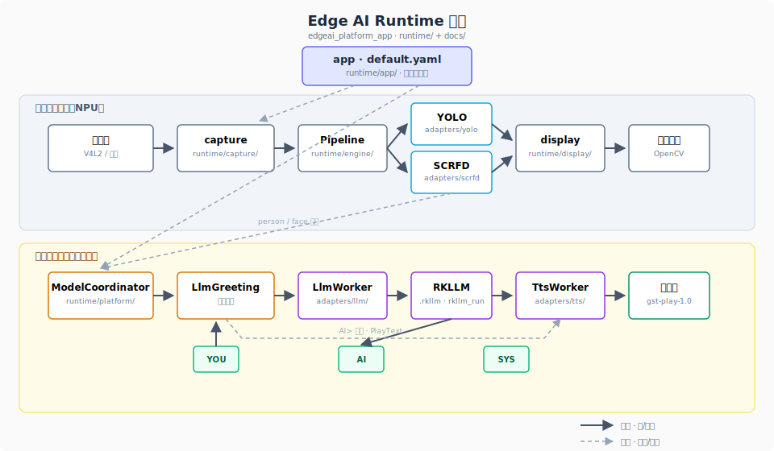

🌐 Language: **English** | [中文](README.cn.md)

# RK3588 Edge AI Inference Platform

Edge AI demo on Rockchip RK3588 NPU (ALIENTEK board). Live camera capture → NPU vision inference → on-device LLM chat after stable face detection—**everything runs on the board**.

Main binary: **edgeai_platform_app**, driven by `runtime/config/default.yaml`. You need the `runtime/` build output and RKNN / RKLLM weights under `model/`.

## Pipeline

Person approaches → YOLO (body) → SCRFD (face) → greeting / terminal chat, with live overlay preview.

Models start and stop by scene; the LLM runs on a separate thread and does not join the per-frame vision Preprocess→Inference→Postprocess path.

## Runtime flow

1. **Startup**: Load YAML and YOLO; preload RKLLM in the background when LLM is enabled.
2. **Each frame**: Capture → run enabled vision slots → main thread draws boxes and shows the frame.
3. **Person present**: Enable SCRFD; when both slots are on, face boxes take priority over YOLO person boxes.
4. **Stable face**: Open the prompt gate and send a greeting; type at `YOU>`, stream reply at `AI>`.
5. **Face lost**: Reject new prompts; finish the current reply; keep the model loaded.
6. **Exit**: ESC or Ctrl+C; release camera, worker threads, and LLM.

Terminal: `SYS>` / `YOU>` / `AI>` on stdout; `[INFO]` and similar on stderr.

## Architecture



*Diagram labels are in Chinese; directory paths match the repository.*

Solid lines: video frames and inference results. Dashed lines: YAML config and person/face detection signals. The LLM generates only when the gate is open, on an independent thread under `adapters/llm/`.

| Layer | Directory | Role |
|-------|-----------|------|
| Entry | `runtime/app/` | Load YAML; start Pipeline and ModelCoordinator |
| Capture / display | `runtime/capture/` `runtime/display/` | Frame capture & rotation; overlays; OpenCV window |
| Engine | `runtime/engine/` | Preprocess → inference → main-thread display |
| Policy | `runtime/platform/` | Scene switching, face gate, auto greeting |
| Models | `runtime/adapters/` | yolo / scrfd / llm plugins; slots enabled on demand |

## Layout

```text
edgeai_platform/
├── model/          # yolov5.rknn, scrfd.rknn, .rkllm
├── assets/         # architecture diagram, etc.
├── runtime/
│   ├── app/ engine/ platform/ capture/ display/
│   ├── adapters/yolo|scrfd|llm/
│   └── config/default.yaml
└── deploy/         # PC-side conversion; not used on board
```

## Quick start

Target: ALIENTEK RK3588, toolchain `/opt/atk-dlrk3588-toolchain`, models in `model/`.

```bash
cd runtime && ./build-linux.sh
cd install/rk3588_linux_aarch64/rknn_edgeai_platform
./edgeai_platform_app config/default.yaml
```

Adjust camera device, model paths, and `model.llm.enabled` in `config/default.yaml` for your board.

## License

MIT License
