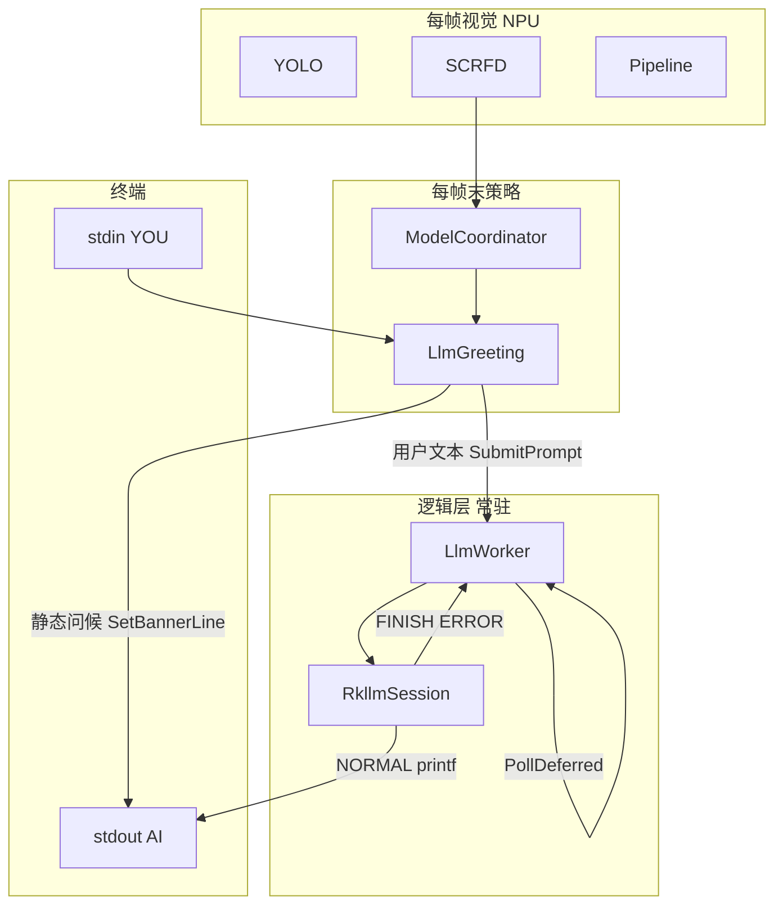
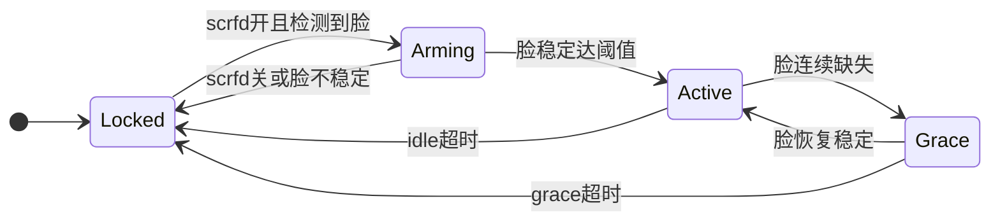

# LLM 与 ModelCoordinator 集成

## 读者须知

- 本文说明 RKLLM（DeepSeek 等 `.rkllm`）在 runtime 中的目录、与视觉流水线的边界、人脸门控与会话状态机，以及麦克风/按键扩展方式。
- LLM 为**逻辑层能力**：**不**实现 `IModelAdapter`，**不**进入 `RunEnabledSlots` / 每帧 `Preprocess→Inference→Postprocess`。
- 实现以当前代码为准；§4 为产品行为定稿，§7 为未完成项。

**相关代码：**

| 模块 | 路径 |
|------|------|
| RKLLM 封装 | [`adapters/llm/rkllm_session.*`](../runtime/adapters/llm/rkllm_session.cpp) |
| 推理与排队 | [`adapters/llm/llm_worker.*`](../runtime/adapters/llm/llm_worker.cpp) |
| 人脸门控与会话 | [`platform/llm_greeting.*`](../runtime/platform/llm_greeting.cpp) |
| 多槽与每帧策略 | [`platform/model_coordinator.cpp`](../runtime/platform/model_coordinator.cpp) |
| 终端输入 | [`engine/pipeline.cpp`](../runtime/engine/pipeline.cpp) `PollTerminalPromptInput` |

---

## 1. 为何放在 `adapters/llm`

| 项 | 说明 |
|----|------|
| 一致性 | 与 `adapters/yolo`、`scrfd` 同级，统一编入 `edgeai_platform_app` |
| 已删除 | 独立 stdin demo / `atk_deepseek_*` 目录（不再维护） |
| API | `rkllm_init` / **`rkllm_run`（同步）** / callback → `rkllm_session` |
| 第三方 | `runtime/3rdparty/rkllm/`：`rkllm.h`、`librkllmrt.so`、`libgomp.so` |

适配器文件与路径速览见 [适配器说明.md](适配器说明.md) § LLM。

---

## 2. 挂钩方案（结论）

| 方案 | 结论 |
|------|------|
| **A. `adapters/llm` + `LlmGreeting` + 独立推理线程** | **采用** |
| B. `IModelAdapter` 每帧 llm 槽 | 不推荐 |
| C. 在协调器或主循环内同步 `rkllm_run` | 不推荐；现为 **`infer_thread_` 内 `rkllm_run`** |
| D. 独立进程 demo | 已删除 |
| E. 云端 API | 超出本阶段 |

---

## 3. 架构



- **自动问候**不经过上图 `Worker→RK`（见 §4.1）。
- `ModelCoordinator::UpdateAfterFrame` 末尾调用 `LlmGreeting::Update`；`llm_greeting_.PollDeferred()` 驱动 init 收尾与排队下一句。

---

## 4. 数据与控制流（现行）

```text
【自动问候】人脸稳定 → TryAutoPromptOnStableFace → SetBannerLine(auto_greeting_text_) → stdout AI>
  （不经 rkllm_run；busy 时不插入）

【用户对话】stdin YOU> → SubmitUserPrompt → SubmitPrompt → RunPromptNow
    → infer_thread_: fprintf("AI> ") → RunPromptSync → rkllm_run
    → StaticCallback: NORMAL printf("%s"); FINISH printf("\n")
    → OnLlmChunk: 仅 FINISH/ERROR，排队 deferred
    → PollDeferred: 下一句 RunPromptNow
```

| 文件 | 角色 |
|------|------|
| `rkllm_session.cpp` | 唯一调用 `rkllm_*`；`RunPromptSync`；回调直写 stdout |
| `llm_worker.cpp` | 异步 `rkllm_init`；`infer_thread_`；`SubmitPrompt` 排队 |
| `llm_greeting.cpp` | Locked/Arming/Active/Grace；门控；静态问候 |
| `model_coordinator.cpp` | 视觉槽；每帧 `PollDeferred` |
| `pipeline.cpp` | 终端 `YOU>` |

**InitOnce：** 首次 `rkllm_init` 成功后进程内保持加载；脸消失 **不** `rkllm_destroy`。权重加载为 `std::async`，只影响首启。

**仍可能影响体感：** YOLO + SCRFD 与 LLM 争用 NPU/带宽；`[INFO]` 等诊断日志在 stderr，与 stdout 会话行分离。

---

## 5. 终端 UX

| 前缀 | 来源 | 路径 |
|------|------|------|
| `SYS>` | 系统提示 | `LogSystem` → stdout |
| `YOU>` | 用户输入 | `Pipeline::PollTerminalPromptInput` |
| `AI>` | **用户对话** | `RunPromptNow` 打印前缀 + `StaticCallback` 流式 |
| `AI>` | **自动问候** | `SetBannerLine` 一次性输出配置文案 |

- 用户对话 **不** 经 `SetBannerLine` 流式转发（`OnLlmChunk` 不处理 NORMAL）。
- `LLM_OUT|...` 为 `SetBannerLine` 在 `is_final` 时的 Debug 汇总（问候等）。
- LLM 不画在 `ResultOverlay` 检测框层。

---

## 6. 行为定稿

### 6.1 Prompt 与生成

| 场景 | 行为 |
|------|------|
| **正在生成** | 说完当前句；脸消失/Grace **不** `rkllm_abort` |
| **人脸稳定（首次/再现）** | 输出 **`auto_greeting_text`**（`SetBannerLine`）；再现时 `FaceReenter` 仅影响日志 source，文案同配置一句 |
| **人脸持续在** | 不自动多轮；等待用户 **终端**（麦克风源已接）或日后按键 |
| **人脸消失** | 关 `prompt_gate`；`DropQueuedPrompts`；当前 RKLLM 句仍播完 |
| **进程退出** | `Pipeline::Stop` → `AbortActiveGeneration` → `Shutdown` / `rkllm_destroy` |

### 6.2 模型生命周期

| 事件 | 动作 |
|------|------|
| 首次需要 LLM | `RequestInitializeAsync` → `rkllm_init`（`preload_on_startup` / `preload_on_scrfd`） |
| 人脸消失 / Grace 超时 / 空闲超时 | 关门控、清排队；**不** 卸载模型 |
| 人脸再次稳定 | 开门控；可再发静态问候（新一次到访） |
| 进程退出 | `LlmWorker::Shutdown` |

### 6.3 明确不做

- 无用户输入时的周期性自动 RKLLM 多轮。
- LLM 注册为 vision 每帧槽。
- 脸消失时 `rkllm_destroy`（与快速再现冲突）。

### 6.4 会话状态机



`LlmWorker` 侧：`NotReady → Initializing → Ready`；`Ready ↔ Generating`（`infer_thread_` 上 `rkllm_run`）。

### 6.5 与 SCRFD

- `person` 场景稳定 → `EnableSlot("scrfd")`。
- 自动问候与门控依赖 `face_detected` + `face_stable_frames`，非每帧 RKLLM。
- SCRFD 五官画点：待实现（与 LLM 无关）。

---

## 7. 麦克风 / 按键 / 待办

**已接：** `Pipeline` → `LlmGreeting::SubmitUserPrompt` → `SubmitPrompt(..., Microphone, gate)`。

**未接：** 按键 → `SubmitPrompt(..., Button)`；`allow_input_without_face` 配置项未实现。

```text
LlmPromptSource: FaceAppear | FaceReenter | Microphone | Button | Command
```

| 待办 | 说明 |
|------|------|
| 按键输入 | `Button` source |
| SCRFD 五点 overlay | 后处理已有坐标，绘制待接 |
| TTS v2 按句播 | v1 已集成 MeloTTS（见 [适配器说明.md](适配器说明.md) § TTS）；增量句界 + 边生成边播未做 |
| 对话期减视觉负载 | 可选：对话中降帧或缩槽 |
| 日志插屏 | 状态迁移多为 `LogDebug`；FPS 等 `LogInfo` 仍可能频繁 |

---

## 8. 配置项

见 [`config/default.yaml`](../runtime/config/default.yaml)：

```yaml
model:
  llm:
    enabled: true
    path: ./model/deepseek-1.5b-w8a8-rk3588.rkllm
    max_new_tokens: 4096      # 与 max_context_len 同值可避免长答截断
    max_context_len: 4096
    preload_on_startup: true
    preload_on_scrfd: true
    face_stable_frames: 5
    face_absent_frames: 10
    grace_timeout_ms: 5000
    idle_timeout_ms: 60000
    auto_greeting_text: "..."   # 静态问候，不经 rkllm_run
```

`enabled` 支持 `true`/`false`（`ConfigParser::GetBool`）。

---

## 9. 调试日志

| 日志 | 含义 |
|------|------|
| `LlmWorker: async InitOnce start` | 开始加载 `.rkllm` |
| `LlmWorker: rkllm_init ok` | 成功，不应重复 init |
| `LlmGreeting: auto greeting emitted` | 静态问候已输出 |
| `LlmGreeting: reject input gate_open=0` | 门控拒绝（Debug） |
| `LlmGreeting: state ... -> ...` | 会话状态迁移（多为 Debug） |
| 终端 `YOU>` / `AI>` | 用户输入 / RKLLM 或静态问候 |
| `LlmWorker: queued one prompt (busy)` | busy 时保留一句排队 |
| `LlmWorker: rkllm_run failed` | 同步推理失败 |
| `LLM_OUT\|src=...\|text=...` | `SetBannerLine` 收尾 Debug |

诊断日志走 **stderr**；会话行走 **stdout**。

---

## 10. 板端启用

1. `.rkllm` 放到 `model.llm.path`。
2. `model.llm.enabled: true`。
3. `cd runtime && ./build-linux.sh`。
4. `cd install/rk3588_linux_aarch64/rknn_edgeai_platform && ./edgeai_platform_app config/default.yaml`。
5. 预期：`scene -> person` → 槽含 `scrfd` → `rkllm_init ok`（一次）→ 人脸稳定 → 静态 `AI>` 问候 → `YOU>` → 流式 `AI>`。

---

## 11. 相关文档

| 文档 | 用途 |
|------|------|
| [系统架构与运行逻辑.md](系统架构与运行逻辑.md) | 平台总览、加载顺序 |
| [接续开发说明.md](接续开发说明.md) | 目录、多槽、编译 |
| [适配器说明.md](适配器说明.md) § LLM | LLM 适配器速览 |
| [模型演进与待办.md](模型演进与待办.md) | 演进路线与 backlog |

---

*文档版本：2026-05-26；对齐 `LlmWorker` / `LlmGreeting` / `rkllm_run` 同步热路径；移除已删除 demo 与 `chat_quiet` 等待办。*
