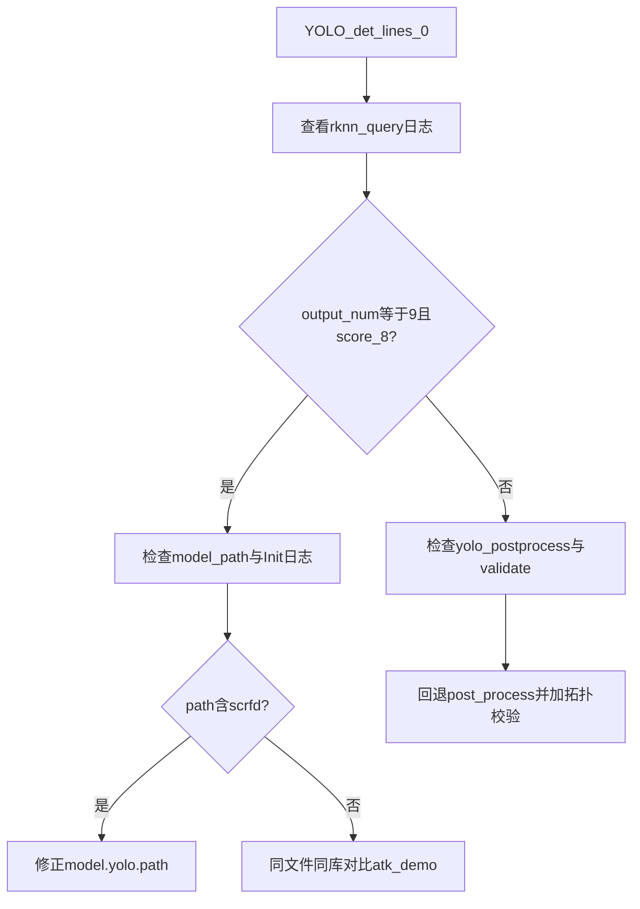

# YOLO 与 SCRFD 问题排查记录

> 归档 SCRFD 替换 RetinaFace 后出现的 YOLO 无框、9 路 `score_8` 误判、SCRFD 满屏乱框、Ctrl+C 无法退出等问题的**症状、调试过程、根因与修复**。  
> 与 [错误修复调试说明.md](错误修复调试说明.md)（SIGSEGV / 退出顺序）互补；与 [接续开发说明.md](接续开发说明.md) §0 必读配合阅读。

---

## 1. 背景与时间线

### 背景

- SCRFD 接入替换 RetinaFace 后，平台 YOLO 长期 **`det_lines=0`**、`person_present=0`，无法触发 person→scrfd 切换。
- 板端与正点原子 `atk_rknn_yolov5_cam` 对**同一份** `yolov5.rknn`（md5 一致）现象曾不一致，排查中一度误判为「两颗不同 rknn 文件」。
- 实际根因集中在：**配置路径误配**、**YOLO 后处理被改坏**、**SCRFD 9 路输出索引映射错误**、**流水线队列阻塞导致无法退出**。

### 排查时间线

| 阶段 | 现象 / 动作 | 结论 |
|------|-------------|------|
| 1 | 怀疑 md5 不同、PC vs 板端文件不一致 | **误导方向**；同 md5 不能排除 `model.yolo.path` 配错 |
| 2 | 日志 `output num: 9`、`score_8/bbox_8/kps_*` | SCRFD 拓扑特征，不是 YOLOv5 融合三头 |
| 3 | 日志 `path=./model/scrfd.rknn` 出现在 **YoloAdapter** Init | **实锤**：YOLO 加载了 SCRFD 模型路径 |
| 4 | 回退 `post_process`、加拓扑校验、修 SCRFD 索引、队列 `TryPush` | 问题可定位、可验证 |

---

## 2. 症状对照表

| 现象 | 日志 / 表现 | 真实原因（已确认） |
|------|-------------|-------------------|
| YOLO 始终 0 框 | `det_lines=0` | ① `model.yolo.path` 指向 SCRFD；② 曾改坏 `post_process`（9 路猜测 + `grid_w<=0 continue`） |
| 以为 yolov5 是 9 路 | `score_8`、`bbox_8`、`kps_8`… | **YoloAdapter 误加载 `scrfd.rknn`**，不是 yolov5 拓扑变化 |
| Init 失败 | `unsupported RKNN outputs=9 ... path=./model/scrfd.rknn` | `validate_yolov5_model_io` 生效，暴露路径错误 |
| SCRFD 满屏检测框 | 切换 scrfd 后框密集乱飞 | `scrfd_postprocess` 按交错 `idx*3` 读 9 路，与实际分组布局不符 |
| Ctrl+C 无法退出 | 多次 `Signal received` 仍卡住 | `BoundedQueue::Push` 阻塞，停机后消费者已退出 |

---

## 3. RKNN 拓扑：如何区分 YOLO 与 SCRFD

### 正点原子 YOLOv5（期望）

```
model input num: 1, output num: 3
  index=0, name=output0, dims=[1, 255, 80, 80], type=INT8（或 UINT8 输入）
```

- 3 路融合头，`dims[1]==255`，grid 80 / 40 / 20。
- 后处理：`adapters/yolo/yolo_postprocess.cpp`，固定解码 `output[0..2]`。

### SCRFD（9 路）

```
model input num: 1, output num: 9
  index=0, name=score_8,  dims=[1, 12800, 1, 0], type=FP16
  index=1, name=score_16, dims=[1, 3200, 1, 0],  ...
  index=3, name=bbox_8,   dims=[1, 12800, 4, 0], ...
  index=6, name=kps_8,    dims=[1, 12800, 10, 0], ...
```

- 命名：`score_{8,16,32}`、`bbox_*`、`kps_*`。
- 本板端实际顺序多为 **分组布局**：先 3 个 score，再 3 个 bbox，再 3 个 kps（非 `score,bbox,kps` 交错）。

### 关键结论

- `init_yolov5_model`（`adapters/yolo/yolo_adapter.cpp`）按正点原子例程：`rknn_init` + `rknn_query`，**不会**在代码里把 3 路变成 9 路。
- 若 **YoloAdapter** 打印 9 路且 `score_8`，应优先查 **`model.yolo.path` 是否指向 `scrfd.rknn`**，而不是先断言「两颗不同 rknn」。

---

## 4. 详细调试过程

### 4.1 日志实锤：YOLO 加载了 scrfd.rknn

典型失败日志：

```text
output tensors:
  index=0, name=score_8, n_dims=3, dims=[1, 12800, 1, 0], type=FP16
  ...
YoloAdapter: unsupported RKNN outputs=9 (need 3 fused heads), path=./model/scrfd.rknn
YoloAdapter init_yolov5_model fail! ret=-1 model_path=./model/scrfd.rknn
ModelCoordinator: failed to init clone 0 for model yolo ... path=./model/scrfd.rknn
```

说明：

- 打印 `model input num` 且带 `score_8` 的，来自 **YoloAdapter**（ScrfdAdapter 不打印该格式）。
- `infer_threads: 3` 时 Init 日志可能重复 3 遍，属正常。

仓库默认配置（`config/default.yaml`）为：

```yaml
model.yolo.path: ./model/yolov5.rknn
model.scrfd.path: ./model/scrfd.rknn
```

板端若把 **`model.yolo.path` 写成 `scrfd.rknn`**（或与 `scrfd.path` 写反），即出现上述现象。

**相对路径** `./model/...` 依赖**启动时的当前工作目录**；从 `install/...` 启动时请核对 `install/model/` 与源码树 `model/` 是否一致。

### 4.2 路径与配置排查步骤

1. 看 Init 日志中的 **`model_path=`** / **`path=`**（不要只看 md5）。
2. 对照正在使用的 yaml（命令行参数传入的 config）。
3. 可选：查看 `YoloAdapter: model realpath=...`、文件大小、RKNN api/drv 版本（已在 `yolo_adapter.cpp` 增加）。
4. 配置项已统一为 `model.yolo.path` / `model.scrfd.path`；旧版顶层 `model.path` 已废弃。

### 4.3 YOLO 后处理回归（曾引入的 bug）

为兼容「9 路输出」曾修改 `yolo_postprocess.cpp`，导致 **静默 0 框**：

| 错误改动 | 后果 |
|----------|------|
| `yolo_resolve_head_output_index`：在全部 output 中找 `dims[1]==255` | 9 路 SCRFD 无 255 通道，退回用 `0,1,2` 读 score 张量 |
| `if (grid_h <= 0 \|\| grid_w <= 0) continue` | `score_8` 的 `dims=[1,12800,1,0]` → `grid_w=0`，三尺度全跳过 |

**正确做法**（与 `yolo_postprocess.cpp` 现行实现一致）：

- 固定 `for (i = 0; i < 3; i++)` 解码 `output[i]`。
- Init 时 **`validate_yolov5_model_io`**：`n_output==3` 且 `output_attrs[0].dims[1]==255`，否则失败并打印各路 name/dims。

### 4.4 SCRFD 满屏乱框

- **根因**：旧代码假定 9 路为 `[score_8, bbox_8, kps_8, score_16, ...]`（`idx*3` 交错）。
- **实际**（用户日志）：`score_8,16,32` → `bbox_8,16,32` → `kps_8,16,32`（分组）。
- **修复**：`scrfd_postprocess.cpp` 中 `ResolveScrfdHeadOutputs`：
  - 优先按名称 `score_{stride}` / `bbox_{stride}` / `kps_{stride}` 匹配；
  - 兼容分组布局（`scale_idx`、`scale_idx+3`、`scale_idx+6`）与旧交错布局。

框仍偏多时，可调高 `model.scrfd.conf_threshold_percent`（如 65~75），**不要**再改 YOLO 的 9 路解码。

### 4.5 Ctrl+C 无法退出

- **根因**：`PreprocessLoop` / `InferenceLoop` 使用 `BoundedQueue::Push`，队列满时**无限阻塞**；`Stop()` 后主线程已退出 `RunPostprocessOnMainThread`，预处理线程仍卡在 `Push`。
- **现象**：多次 `Signal received, request stop`，进程不结束。
- **修复**：`pipeline.cpp` 中改为 `TryPush(..., 100ms)`，超时后检查 `ShouldStop()`；保留 `frame_id=-1` 退出哨兵。

更完整的退出顺序与 SIGSEGV 排查见 [错误修复调试说明.md](错误修复调试说明.md)。

### 4.6 调试决策流



---

## 5. 已实施代码修复清单

| 文件 | 改动要点 |
|------|----------|
| `adapters/yolo/yolo_postprocess.cpp` | 固定三头解码；移除 `yolo_resolve`、`grid_w<=0` 跳过 |
| `adapters/yolo/yolo_adapter.cpp` | `validate_yolov5_model_io`；`realpath`/文件大小/RKNN SDK 版本日志 |
| `app/main.cc` | 读取 `model.yolo.path` / `model.scrfd.path`（无路径启发式） |
| `adapters/scrfd/scrfd_postprocess.cpp` | `ResolveScrfdHeadOutputs` 按名解析 9 路输出 |
| `engine/pipeline.cpp` | 队列 `TryPush` 避免停机死锁 |
| [适配器说明.md](适配器说明.md) § YOLO | 后处理约束说明 |

---

## 6. 板端验证 Checklist

1. **启动日志**
   - `YoloAdapter` / Init：`model_path=./model/yolov5.rknn`（或 realpath 指向 yolov5）。
   - `output num: 3`，`out0` 的 `dims[1]=255`。
2. **YOLO 阶段**
   - 日志周期性 `det_lines>0`（如每 60 帧）。
   - 画面有 COCO 检测框；`person` 可触发 scrfd 切换。
3. **SCRFD 阶段**
   - 人脸框数量合理，非满屏；必要时调高 `conf_threshold_percent`。
4. **退出**
   - `Ctrl+C` 一次退出，无反复卡住。
5. **若仍为 9 路 `score_8`**
   - 先看 `path=` 是否为 `scrfd.rknn`；**不要**为 YOLO 编写 9 路分离解码。

---

## 7. 经验教训（不要做）

1. **不要**仅凭 md5 断言「两颗不同 rknn」，而忽略 **`model.yolo.path` 配错**（本次直接根因之一）。
2. **不要**对 YOLO 做 9 路 `score/bbox/kps` 分离解码（那是 SCRFD 拓扑）。
3. **不要**在 `post_process` 里对异常 grid 静默 `continue`（会导致 0 框且无明确报错）。
4. **不要**在流水线队列上使用无超时的阻塞 `Push`（会导致无法退出）。
5. **排查顺序建议**：配置路径 → Init 日志 topology → `yolo_postprocess` 是否固定三头解码 → `librknnrt.so` / 启动目录。

---

## 8. 相关文档

| 文档 | 内容 |
|------|------|
| [接续开发说明.md](接续开发说明.md) | 目录结构、切换语义、配置、常见问题 |
| [错误修复调试说明.md](错误修复调试说明.md) | SIGSEGV、退出顺序、sentinel 任务 |
| [适配器说明.md](适配器说明.md) § YOLO | YOLO 后处理约定 |

---

*文档版本：2026-05，对应 runtime 中 YOLO/SCRFD 路径防呆、后处理回退、SCRFD 索引修复、Pipeline TryPush 等改动。*
