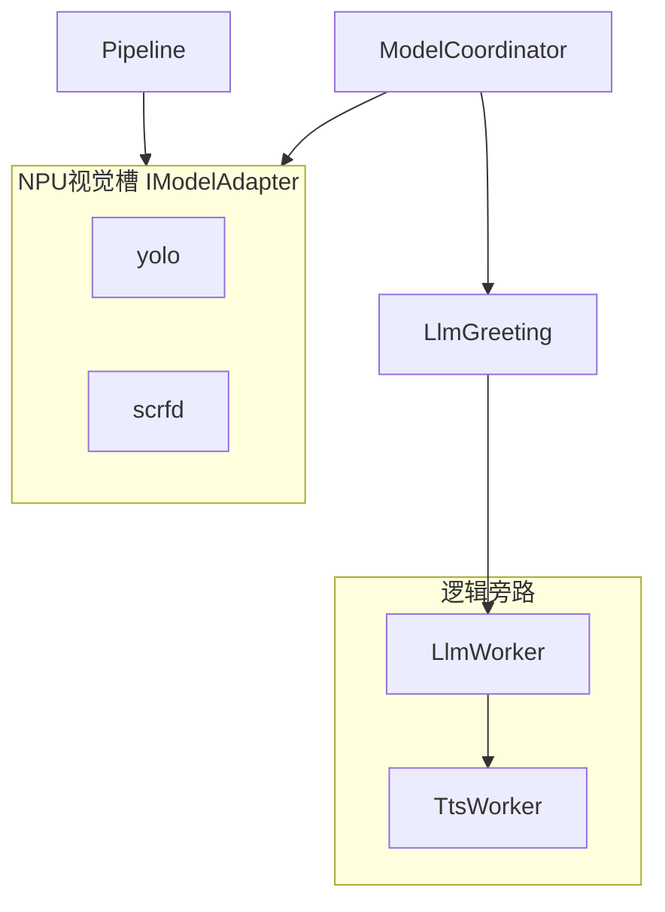
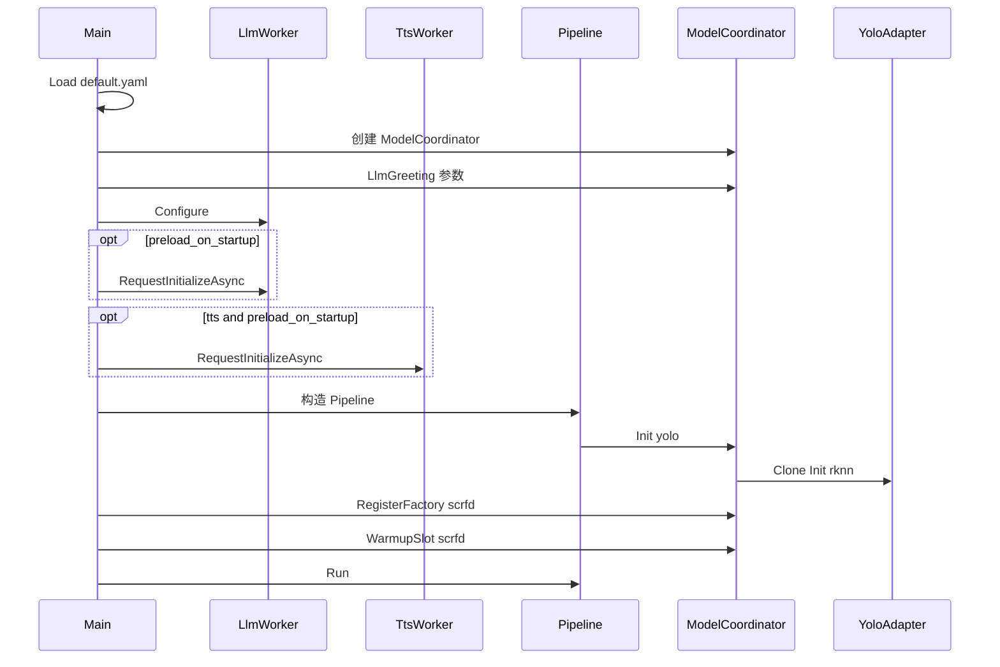
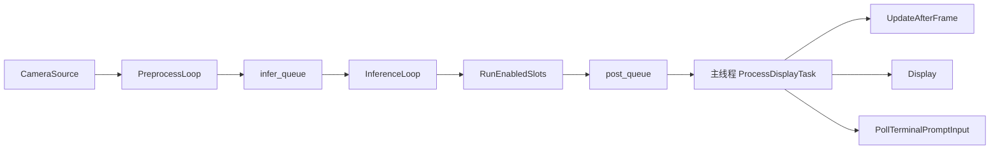
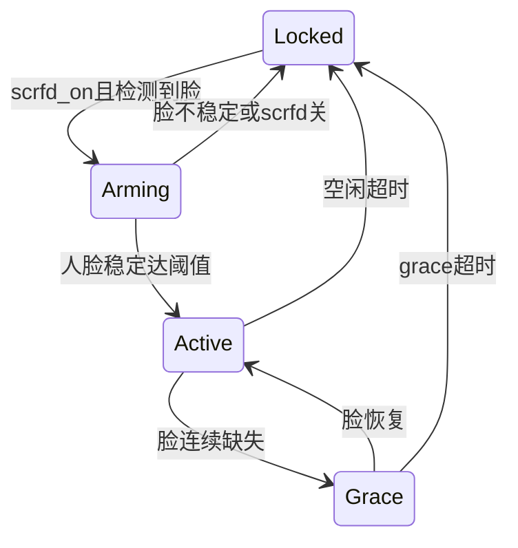

# 系统架构与运行逻辑

> **Edge AI Runtime** 在 RK3588 NPU 上的可扩展平台说明：模块加载、调用顺序、框架、槽关系与设计取舍。  
> **参考应用**：当前 `default.yaml` 落地的人脸检测 + 对话 + TTS 语音（非平台唯一形态）。  
> 实现以仓库代码为准；单模块细节见文末文档索引。

---

## 1. 平台定位与边界

### 1.1 是什么

- **平台**：`edgeai_platform_app` + `runtime/` 分层代码 + `runtime/config/default.yaml` 驱动 + `adapters/` 插件式模型。
- **目标硬件**：Rockchip RK3588（及同系列 NPU）；正点原子等板型通过改 yaml（摄像头、模型路径、`npu_cores`）适配。
- **扩展方式**：新增 `IModelAdapter` 视觉槽、扩展 `ModelCoordinator` 场景、新增逻辑旁路（类似 `LlmWorker` / `TtsWorker`），**不必**改 Pipeline 内核。

### 1.2 参考应用（当前默认）

在默认配置下，平台表现为：

1. 摄像头采集 → YOLO 人形哨兵 → 有人时 SCRFD 人脸 → 预览叠加框；
2. 人脸稳定 → 终端 `AI>` 问候（yaml 静态文案）+ **TTS 播报**；
3. 用户 `YOU>` 输入 → RKLLM 流式 `AI>` → 轮次结束 **TTS 播报**；
4. 人脸离开 → 门控 Grace/锁定，拒绝新输入。

换业务（仅安防、无对话、多路等）通过关闭 `model.llm` / 改槽策略 / 新 adapter 实现，平台内核复用。

### 1.3 边界

| 参与板端运行 | 不参与 |
|--------------|--------|
| `runtime/` 编译产物 | 仓库根 `deploy/`（PC 侧转换） |
| 仓库根 `model/*.rknn`、`.rkllm`、词表 | Cursor worktree 副本 |
| `runtime/3rdparty`、`runtime/utils`（只读链接） | 已移除的 PPOCR / document 场景 |

架构示意图：仓库根 [`README.md`](../README.md)、[`assets/architecture.svg`](../assets/architecture.svg)。

---

## 2. 分层与目录

```text
edgeai_platform/
├── model/                 # 板端权重（rknn / rkllm / lexicon）
├── docs/                  # 平台文档（本目录）
├── runtime/
│   ├── app/               # main、ConfigParser
│   ├── engine/            # Pipeline、IModelAdapter、队列、线程池
│   ├── platform/          # ModelCoordinator、LlmGreeting、日志
│   ├── adapters/          # yolo / scrfd / llm / tts 插件
│   ├── capture/ display/  # 采集、旋转、叠加、窗口
│   ├── config/            # default.yaml（唯一默认配置源）
│   ├── utils/             # 正点原子工具（勿改）
│   └── 3rdparty/          # rknn / rkllm 等（勿改）
└── deploy/                # 非板端
```

| 层 | 职责 |
|----|------|
| **app** | 读 yaml、组装 Coordinator / LLM / TTS / Pipeline、信号处理 |
| **engine** | 多线程流水线：采帧 → 推理 → 主线程显示与策略回调 |
| **platform** | 视觉槽启停、场景去抖、人脸门控、与 LLM 挂钩 |
| **adapters** | 具体模型：视觉实现 `IModelAdapter`；LLM/TTS 为逻辑旁路 |

**核心原则**

- 视觉模型：**每帧** `Preprocess → Inference → Postprocess`，经 `RunEnabledSlots` 调度。
- LLM / TTS：**不进** `IModelAdapter`，不占视觉槽位，独立线程与生命周期。
- 配置：**仅** `default.yaml`，`main.cc` 不兜底默认值。

---

## 3. 设计 rationale 与方案对比

| 决策点 | 现行方案 | 主要备选 | 取舍 |
|--------|----------|----------|------|
| 视觉 vs 对话 | `IModelAdapter` 槽 + `LlmWorker` 旁路 | LLM 也注册为每帧 adapter | LLM 为秒级生成；塞入 Pipeline 会拖垮显示帧率与 stdin 响应 |
| 多模型共存 | `ModelCoordinator` 按场景 Enable/Disable + **warm 池** | 全部 RKNN 常开 | NPU/内存有限；person 才开 scrfd；禁用不销毁，加速再开 |
| LLM 执行位置 | 独立 `infer_thread_` + 同步 `rkllm_run` | 主线程 `rkllm_run` | 主线程负责 OpenCV 显示与 `PollTerminalPromptInput`；阻塞会卡窗、ESC 失效 |
| LLM 预加载时机 | `preload_on_startup` 在 Pipeline/YOLO Init **之前** | 先视觉后 LLM | 产品要求减首句延迟；缺 `.rkllm` 时 **stat 预检** 跳过 `rkllm_init`，进入**仅视觉降级**（见 §5、§8） |
| 缺对话模型 | **仅视觉降级**：视觉照常；SYS 明示；无 `AI>` 问候、不开放 `YOU>` | 仍打问候/「可输入」 | 避免「看起来能聊、实际不能」 |
| 自动问候 | yaml 静态 + `SetBannerLine`，**不经** RKLLM | 问候也 `rkllm_run` | 确定、零 token、即时上屏/播报 |
| TTS | 已集成 `TtsWorker` + MeloTTS RKNN，播 `AI>` 同源文案 | 无语音 / 云端 TTS | 展台需扬声器反馈；板端闭环，`gst-play-1.0` 播放 |
| 终端 UX | `SYS>` / `YOU>` / `AI>` 分流 | 纯 GUI 聊天 | 板端串口与调试友好；窗口只管视觉 overlay |
| 配置来源 | 单文件 `default.yaml` | 代码内默认 | 板端行为可审计、可 diff |

**是否有更好方案？** 取决于产品：纯安防可 `model.llm.enabled: false`；多摄像头需扩展 `CameraSource` 与 Pipeline 输入抽象（见 [模型演进与待办.md](模型演进与待办.md)）。当前架构在「单路相机 + 按需 NPU 槽 + 旁路对话」下平衡了复杂度与 RK3588 资源。

---

## 4. 两类「槽」与关系



| 名称 | 类型 | 启停依据 | 实例 |
|------|------|----------|------|
| `yolo` | 视觉 | idle/person + `yolo_always_on` | `Clone`+`Init`，warm 池 |
| `scrfd` | 视觉 | person 场景 | 工厂懒加载 + `WarmupSlot` |
| LLM | 逻辑 | `model.llm.enabled`、预加载、门控 | `LlmWorker` |
| TTS | 逻辑 | `model.llm.tts.enabled`（已集成） | `TtsWorker` |

**信号链**：各 adapter `GetAdapterSignals()` → `AdapterSignals`（`person_present`、`face_detected` 等）→ `MergeSlotSignals` → `ModelCoordinator::UpdateAfterFrame` → 场景/槽计划 + `LlmGreeting::Update`。

---

## 5. 进程启动与模块加载顺序

设计约定：**LLM 与已集成 TTS** 的 `preload_on_startup` 在 Pipeline/YOLO Init **之前**（yaml `enabled` 为功能开关），以优先加载对话模型、减少用户走近后的等待。



| 阶段 | 动作 |
|------|------|
| 1 | `ConfigParser::LoadFromFile` |
| 2 | `ModelCoordinator` + `LlmGreeting` 阈值/问候/预加载策略 |
| 3 | `LlmWorker::Configure`；若 `preload_on_startup` → `RequestInitializeAsync`（**先 stat 模型文件**，缺失则标记 Failed、**不调 rkllm_init**） |
| 4 | 若启用 TTS 且 `tts.preload_on_startup` → `TtsWorker::RequestInitializeAsync` |
| 5 | 构造 `Pipeline`：开摄像头 → `coordinator.Init("yolo")` **同步** `rknn_init` |
| 6 | `RegisterFactory("scrfd")` + `WarmupSlot`（预热后入 warm 池） |
| 7 | `pipeline.Run()` → `LlmGreeting::LogStartupHint()` 按 LLM 状态打一条 `SYS>`；退出时 `TtsWorker`/`LlmWorker::Shutdown` |

**`RequestInitializeAsync` 预检**：`stat` 缺失或非普通文件 → `InitState::Failed`、**不调 `rkllm_init`**；`rkllm_init` 异步失败同样置 `Failed`。`Failed` 本进程内不重试（`Configure` 可重置）。

**`LogStartupHint`（`Pipeline::Run` 入口）**

| LLM 状态 | `SYS>` 文案（`model.llm.enabled=false` 时不打印） |
|----------|--------------------------------------------------|
| `Failed`（已在预检/init 时提示） | 不重复 |
| `Ready` | `输入通道已就绪，人脸稳定后可对话` |
| `Initializing` / 未开始 | `对话模型加载中，请稍候` |

代码入口：[`app/main.cc`](../runtime/app/main.cc)、[`engine/pipeline.cpp`](../runtime/engine/pipeline.cpp) 构造函数。

---

## 6. 运行时：Pipeline 与线程

默认 **多线程**（`system.switch.single_thread: false`）：



| 线程 | 职责 |
|------|------|
| `pre_thread_` | 读帧、旋转、push `infer_queue`（满则丢帧） |
| `infer_threads_` | `RunEnabledSlots`：对**当前 enabled** 视觉槽顺序三阶段，push `post_queue` |
| **主线程** | `ProcessDisplayTask`：策略更新 → 画框/badge → 显示；轮询 stdin `YOU>` |

要点：

- `UpdateAfterFrame` 在**绘制前**调用，保证 badge 与门控状态与当前帧一致。
- `yolo`+`scrfd` 同开时 `ShouldSuppressYoloPersonDraw`：只画人脸框，避免双层 person 框。
- `InferenceTask.frame_id == -1` 为退出哨兵；`Stop()` 时 `AbortActiveGeneration`、释放相机、投递 quit。

---

## 7. ModelCoordinator：场景与槽计划

**两层去抖**

1. **CoordinatorScene**（`idle` / `person`）：`person_present` 连续帧 vs `present_threshold` / `absent_threshold`，再经 `scene_dwell_frames` 驻留才 `applied_scene_`。
2. **SlotPlan**：

| applied_scene | want_yolo | want_scrfd |
|---------------|-----------|------------|
| Idle | `yolo_always_on` | false |
| Person | true | true |

`EnableSlot`：优先从 warm 池恢复；否则 `prototype->Clone()` + `Init`。`DisableSlot`：runtime 移入 warm 池，**不 destroy RKNN**。

NPU 核：`system.npu_cores[0]`→yolo，`[1]`→scrfd（`CoreMaskForSlot`）。

每帧末：`llm_greeting_.Update(signals, scrfd_on)` + `PollDeferred()`（LLM init 收尾、TTS init、排队提交）。

---

## 8. LlmGreeting 会话门控（摘要）



| 状态 | 用户可见 |
|------|----------|
| Locked / Arming | `YOU>` 可能被拒（gate 关） |
| Active | **模型 Ready** 时可对话；稳定后静态问候上 `AI>` |
| Grace | 短暂离开仍可能受理（须 Ready）；超时回 Locked |
| **仅视觉（`IsLoadFailed`）** | `SYS> 仅视觉模式（对话模型未加载）`；**无** `AI>` 问候；`YOU>` → `对话不可用（模型未加载）` |

- **问候**：`TryAutoPromptOnStableFace` → `SetBannerLine`（静态 yaml）；**仅 `LlmWorker::IsReady()`** 时输出，失败降级时不播。
- **门控**：`prompt_gate_open_` 仅在 **Ready** 时为人脸稳定打开；加载完成后 `TryOpenDialogueIfReady` 补开门控与问候。
- **对话**：`SubmitUserPrompt` → `LlmWorker::SubmitPrompt` → `infer_thread_` 内 `rkllm_run`（`Failed` 时拒绝，不排队 init pending）。
- SCRFD 首次激活可 `TryPreload` 触发 LLM 异步加载（`preload_on_scrfd`）。

详见 [LLM与ModelCoordinator集成.md](LLM与ModelCoordinator集成.md)、[适配器说明.md](适配器说明.md) § LLM。

---

## 9. TTS 语音链路（已集成）

平台已集成 MeloTTS：`model.llm.tts.enabled` 控制是否启用（默认配置下为完整语音链路）。

```text
SetBannerLine(问候) ──► TtsWorker::PlayText
FINISH(reply_accumulator) ──► TtsWorker::PlayText
TtsWorker → MeloTtsSession → RKNN → /tmp/edgeai_tts.wav → gst-play-1.0
```

- 新 `YOU>` / `Abort` / `Stop` → `TtsWorker::Cancel`。
- v1：整轮 FINISH 后 batch 合成（非逐 token 边播）。

详见 [TTS与MeloTTS集成说明.md](TTS与MeloTTS集成说明.md)、[适配器说明.md](适配器说明.md) § TTS。

---

## 10. 配置与模块映射（节选）

| yaml 键 | 模块 | 用户可见效果 |
|---------|------|--------------|
| `model.yolo.path` | YoloAdapter | 人形检测框 |
| `model.scrfd.*` | ScrfdAdapter | 人脸框 |
| `system.slots.yolo_always_on` | SlotPlan | 无人时是否仍跑 yolo |
| `system.switch.present_threshold` | CoordinatorScene | 多久判定「有人」 |
| `model.llm.enabled` | LlmWorker | 是否启用对话链路；缺 `.rkllm` 时视觉仍跑，对话降级为仅视觉 |
| `model.llm.preload_on_startup` | 启动顺序 | 是否先于视觉加载 LLM |
| `model.llm.auto_greeting_text` | LlmGreeting | `AI>` 问候文案 |
| `model.llm.tts.enabled` | TtsWorker | 是否语音播报 |
| `input.show_window` | Display | 是否有预览窗 |

完整字段见 [`config/default.yaml`](../runtime/config/default.yaml) 注释。

---

## 11. 参考应用：人脸对话场景时间线

```text
摄像头 ──► 预览窗（框 + badge）
        ├─► 终端（SYS> / YOU> / AI>）
        └─► 扬声器（TTS，默认配置开启）
```

| 阶段 | 屏幕 | 终端 | 语音 TTS | 后台 |
|------|------|------|----------|------|
| 启动（缺 `.rkllm`） | 预览正常 | `SYS> 仅视觉模式（对话模型未加载）` | 静音 | `Failed`，不调 `rkllm_init` |
| 启动（加载中） | 预览正常 | `SYS> 对话模型加载中，请稍候` | 静音 | `Initializing` |
| 待机 | badge `yolo` 或 `none` | Ready 后 `SYS> 输入通道已就绪…` | 静音 | idle |
| 走近 | person 去抖后 `yolo+scrfd`，人脸框 | — | 静音 | Enable scrfd |
| 驻足 | 框稳定 | `AI>` 问候 | **播报问候** | Active，`SetBannerLine` |
| 提问 | 框持续 | `YOU>` → 流式 `AI>` | **FINISH 后播报** | `rkllm_run` |
| 连问 | — | 新 `YOU>` | Cancel 旧音，播最新 | 最新优先，非 FIFO |
| 离开 | Grace 后无框策略 | 新输入 rejected | 静音 | `prompt_gate_open=false` |
| 退出 | 窗口关闭 | — | — | ESC / Ctrl+C → Shutdown |

---

## 12. 停止与资源释放

1. `Pipeline::Stop`：`LlmGreeting::AbortActiveGeneration`、`camera_.Release`、quit 哨兵。
2. `main` 返回前：`tts_worker->Shutdown()`、`llm_worker->Shutdown()`（join 推理线程、`rkllm_destroy`）。
3. 常见问题：Ctrl+C 不退、退出 SIGSEGV → [错误修复调试说明.md](错误修复调试说明.md)。

---

## 13. 文档索引

| 文档 | 说明 |
|------|------|
| [系统架构与运行逻辑.md](系统架构与运行逻辑.md) | 本文 |
| [接续开发说明.md](接续开发说明.md) | 编译、目录、接续开发 |
| [适配器说明.md](适配器说明.md) | YOLO / SCRFD / LLM / TTS 适配器速览 |
| [LLM与ModelCoordinator集成.md](LLM与ModelCoordinator集成.md) | 门控、终端、RKLLM 细节 |
| [TTS与MeloTTS集成说明.md](TTS与MeloTTS集成说明.md) | TTS 配置与验收 |
| [YOLO与SCRFD问题排查记录.md](YOLO与SCRFD问题排查记录.md) | 路径与拓扑排障 |
| [错误修复调试说明.md](错误修复调试说明.md) | 崩溃与退出 |
| [模型演进与待办.md](模型演进与待办.md) | 演进路线与 backlog |
| [doc-readme.md](doc-readme.md) | docs 总索引 |

---

*以仓库当前代码为准；与专文冲突时以代码为准。*
